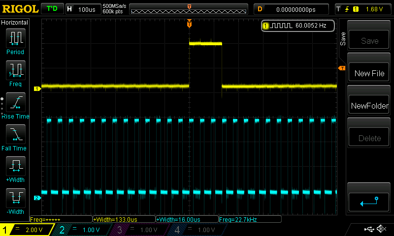
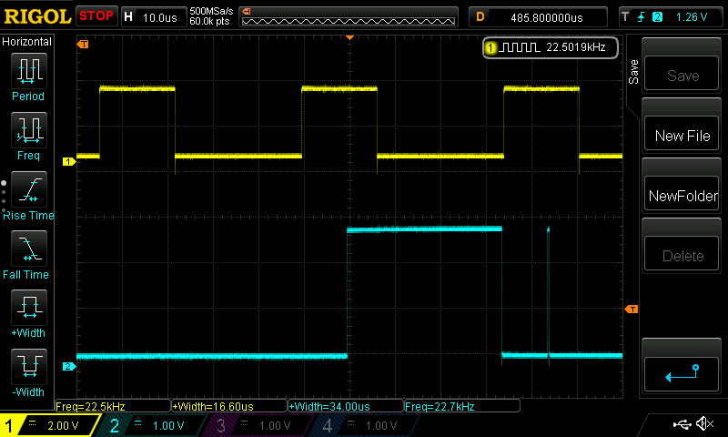
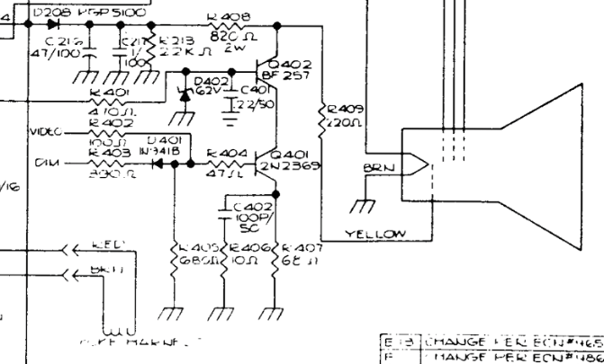

# WY-55 Video Replacement

## Notes

This is a project to interface with the video connector for the WY-55 terminal.

The video connection is via a 12 pin connector. Pin numbering matches the
schematic. Nominal colours are from the schematic, actual colours are from the
connector. Signal is the signal name. Note that pin 1 as labelled on the
*connector* is pin 12.

| Pin | Nominal Colour | Actual Colour | Signal
|-|-|-|-|
|1|White|White|VIDEO|
|2|Black|Black|GND|
|3|Orange|Orange|!DIM|
|4|Yellow|Yellow|HSYNC|
|5|Green|Green|VSYNC|
|6|Blue|Blue|+12V|
|7|Grey|Grey|-12V|
|8|Red|Red|+5V|
|9|Black|Black|GND|
|10|Black|Brown|GND|
|11|Purple|Purple|-23V|
|12|Red|White|+5V|

When the connector is unplugged, only pin 8 has +5V on it. When connected the
other volatages are present suggesting that the other voltages are generated on
the main board.

The following trace shows the VSYNC signal (top) and HSYNC (bottom):

Signals appear to be ~3V peak-to-peak. VSYNC has a frequency of 60Hz, HSYNC has
a frequency of 22.7kHz. VSYNC pulse width is 133µs. HSYNC pulse width is 16µs.

The following trace shows the HSYNC signal (top) and VIDEO signal (bottom) for
the horizontal line on the display along with the cursor on the line below.

HSYNC frequency as measured by the hardware counter is 22.5kHz. The visible line
width is 34µs. The *end* of the visible area is associated with the +ve going
HSYNC edge.

The VIDEO signal itself directly drives the electron gun and so is an analogue
signal:

If we leave !DIM disconnected we can drive intensity through the VIDEO signal
alone.
